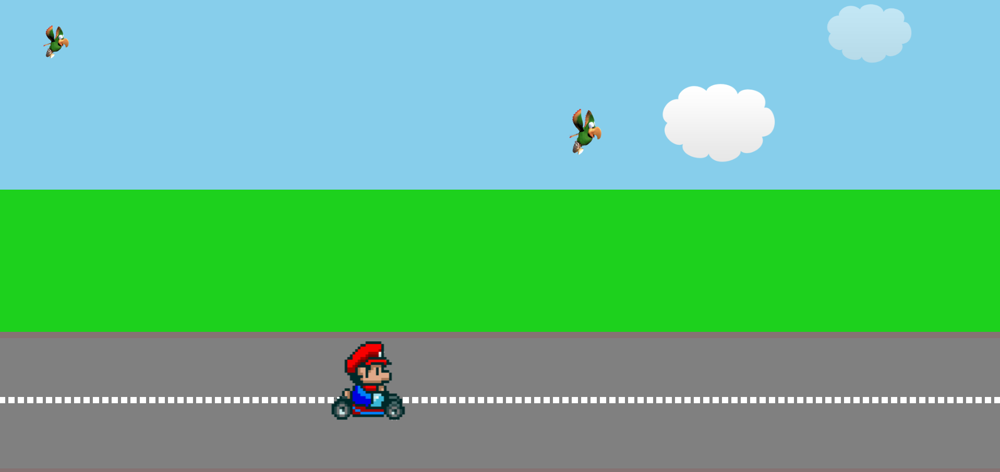

# Mario Game Animation

This project creates a fun, animated scene using HTML and CSS, featuring Mario driving across a road, clouds floating, and birds flying in the sky.

## Features
- **Mario Animation**: Mario moves across the screen and performs a jump animation.
- **Cloud Animation**: Clouds move across the sky with varying speeds.
- **Bird Animation**: Birds fly across the screen from left to right.

## Technologies Used
- **HTML**: Markup structure for the web page.
- **CSS**: Styles and animations for the elements.

## Setup
1. Clone the repository to your local machine:
   ```bash
   git clone https://github.com/your-username/repository-name.git
## Screenshot

